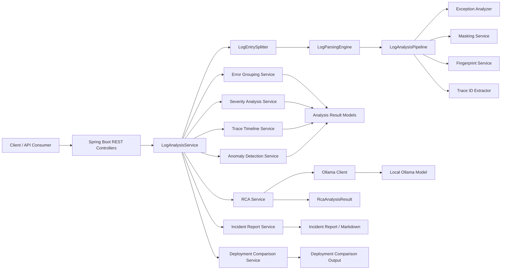
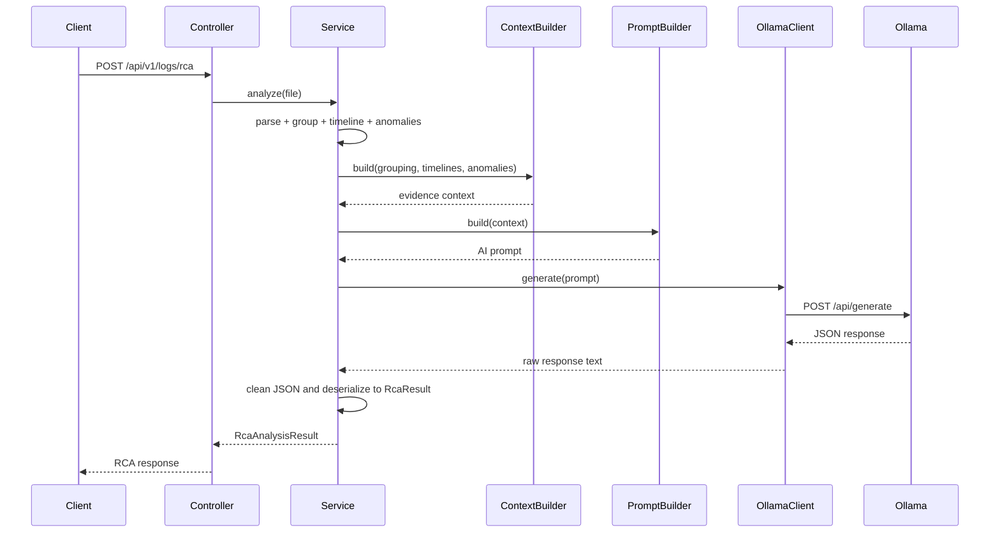
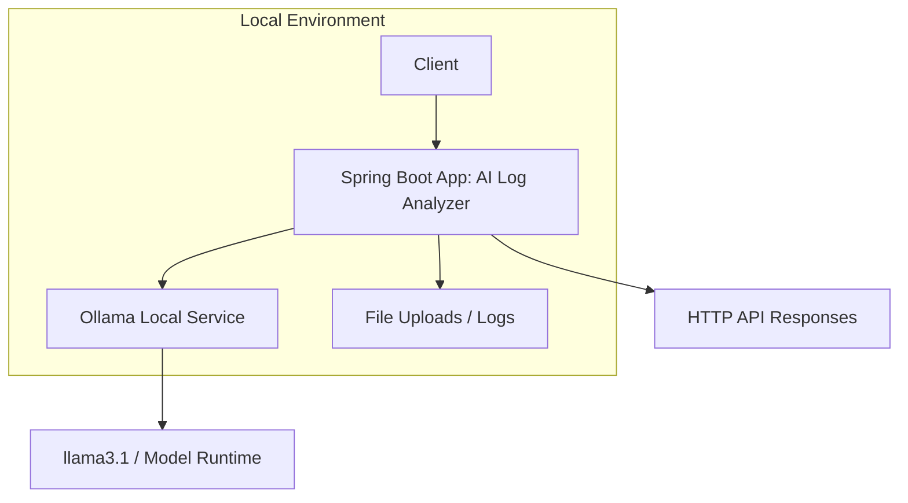
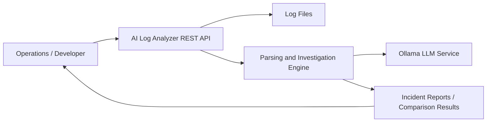
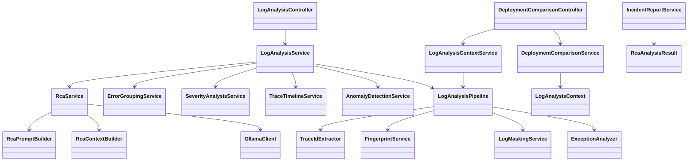

# AI Log Analyzer Backend

AI Log Analyzer is a Spring Boot backend service that reads application log files, extracts structured events, groups recurring failures, detects anomalies, and performs AI-assisted root cause analysis with Ollama.

The service is designed for operational investigation workflows where engineering teams need to quickly identify probable incidents, compare pre/post deployment behavior, and generate incident summaries from logs.

## Overview

This project processes uploaded raw log files and converts them into a normalized analysis pipeline:

- Parse log lines into structured events
- Detect exceptions and severity signals
- Mask sensitive values in logs
- Build fingerprints for recurring errors
- Group similar failures together
- Create trace timelines and anomaly summaries
- Run RCA using Ollama LLM context
- Generate incident reports and deployment comparisons

## Project Architecture

The backend follows a layered Spring application structure:

- Controllers: request entry points for log and comparison APIs
- Services: orchestration and domain workflows
- Analysis modules: anomaly detection, grouping, tracing, severity, masking, fingerprinting, exception analysis
- AI module: Ollama integration and RCA prompt generation
- Model package: response and analysis data structures

### High-Level Architecture Diagram

### RCA Sequence Diagram

### Deployment View

### System Context Diagram

### Class-Level Architecture Summary

## Main Modules

- com.coe.ailoganalyzer.loganalyzerv2.controller
  - REST APIs for log processing and incident workflows
- com.coe.ailoganalyzer.loganalyzerv2.service
  - Core orchestration for log analysis and context construction
- com.coe.ailoganalyzer.loganalyzerv2.ai
  - Ollama client, prompt builder, and RCA logic
- com.coe.ailoganalyzer.loganalyzerv2.grouping
  - Error grouping and frequency aggregation
- com.coe.ailoganalyzer.loganalyzerv2.trace
  - Trace extraction and timeline generation
- com.coe.ailoganalyzer.loganalyzerv2.anomaly
  - Anomaly detection based on grouped and prioritized findings
- com.coe.ailoganalyzer.loganalyzerv2.report
  - Incident reporting and markdown rendering
- com.coe.ailoganalyzer.loganalyzerv2.comparision
  - Deployment drift and regression comparison

## Features

- File-based log analysis via multipart uploads
- Exception classification and severity estimation
- Error fingerprinting for grouping repeated failures
- Trace timeline reconstruction
- Anomaly detection across grouped failures
- AI root cause analysis through local Ollama
- Incident report creation with recommendations
- Deployment comparison between before/after log sets

## API Endpoints

Base path: /api/v1/logs

- POST /api/v1/logs/parse
- POST /api/v1/logs/analyze-exceptions
- POST /api/v1/logs/analyze
- POST /api/v1/logs/group
- POST /api/v1/logs/timeline
- POST /api/v1/logs/anomalies
- POST /api/v1/logs/rca
- POST /api/v1/logs/incident-report
- POST /api/v1/logs/incident-report/markdown
- POST /api/v1/logs/deployment-comparison

All log-related endpoints accept multipart file uploads using the file request parameter. The deployment comparison endpoint accepts before and after files.

## Configuration

Application configuration is defined in the resources file:

- src/main/resources/application.yaml

Important settings:

- server.port: 8080
- ollama.base-url: http://localhost:11434
- ollama.model: llama3.1
- ollama.temperature: 0.1

The app expects Ollama to be running locally and the configured model to be pulled before running RCA analysis.

## Prerequisites

- Java 21
- Maven
- Ollama installed and running locally
- A model pulled in Ollama, for example:
  ollama pull llama3.1

## Run the Application

From the project root:

./mvnw spring-boot:run

On Windows PowerShell:

./mvnw.cmd spring-boot:run

## Build and Test

Run the test suite:

./mvnw test

Run full verification with coverage gate:

./mvnw verify

The project has JaCoCo configured with a minimum line coverage threshold of 90%.

## Notes on AI RCA

Root cause analysis depends on local Ollama responses. If Ollama is unavailable or the selected model is missing, the RCA service returns a failed result rather than crashing the application.

This design keeps the backend resilient while still providing AI-based investigation support when the service is available.

## Security and Data Handling

The application includes masking logic to reduce exposure of sensitive log content before deeper analysis. In its current design, it is focused on local file processing and does not include persistent storage or user authentication.

## Related Documentation

- SDS.md — Software Design Specification

## Summary

This project is a modular log analysis engine built for operational diagnostics, failure grouping, anomaly detection, and AI-assisted root cause analysis. It combines conventional log processing with modern LLM-guided investigation workflows to support faster incident understanding and response.
