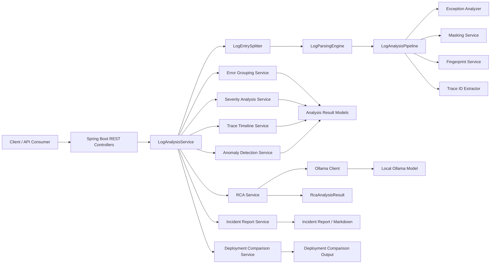
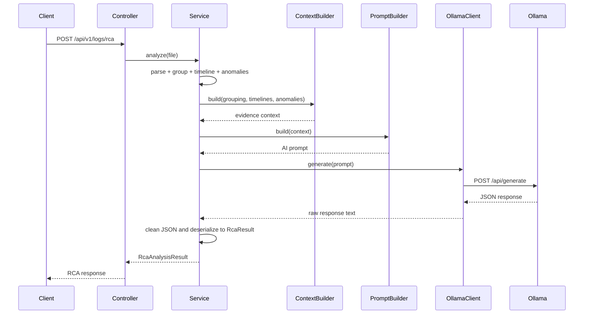
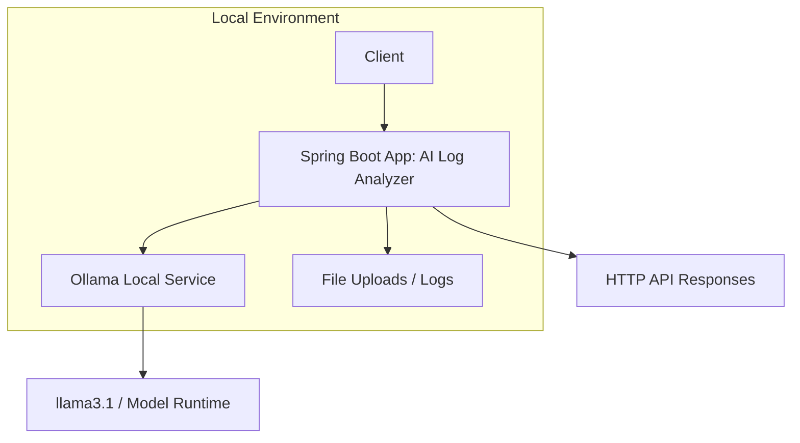
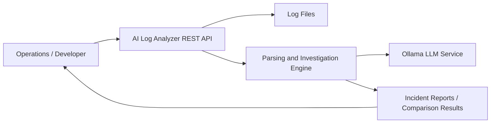
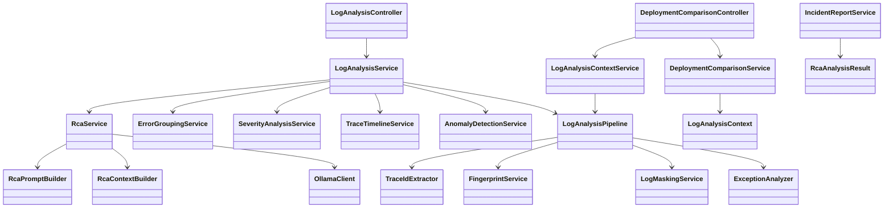

# Software Design Specification (SDS)

## 1. Purpose
This project provides a backend service for analyzing application logs, detecting issues, grouping recurring failures, and generating incident-level insights. It is designed to ingest raw log files, parse structured log events, identify anomalies, correlate trace data, and produce root-cause analysis using a local Ollama LLM.

The system is implemented as a Spring Boot REST API and is intended to support operational monitoring, regression comparison, and incident reporting.

## 2. Scope
The system covers:
- Log parsing and event extraction
- Exception detection and classification
- Error grouping and fingerprinting
- Severity analysis
- Trace timeline reconstruction
- Anomaly detection
- Root cause analysis with AI
- Deployment comparison between two log sets
- Incident report generation and markdown export

Out of scope for this version:
- Persistent database storage
- Authentication and authorization
- Multi-tenant support
- Real-time streaming log ingestion
- UI/dashboard application

## 3. System Overview
The application is centered around a single REST backend running on port 8080. It accepts uploaded log files via multipart requests, processes them into structured events, and applies a chain of analysis stages.

### High-Level Flow
1. Read uploaded log file content.
2. Split content into individual log entries.
3. Parse each entry into a normalized LogEvent object.
4. Analyze each event for exception details, masking status, trace IDs, and fingerprint data.
5. Aggregate results into grouping, severity, and timeline outputs.
6. Detect anomalies and root causes.
7. Produce either structured API responses or an incident report.

### High-Level Architecture Diagram

### RCA Sequence Diagram

### Deployment View

### System Context Diagram

### Class-Level Architecture Summary

## 4. Architectural Design
### 4.1 Runtime Platform
- Java 21
- Spring Boot 4.1.0
- Maven
- Ollama local AI service

### 4.2 Main Components
#### Controller Layer
Located under the controller package.

- LogAnalysisController
  - Handles file-based endpoints for parsing, exception analysis, grouping, timeline analysis, anomaly detection, RCA, and report generation.
- DeploymentComparisonController
  - Compares two uploaded log sets before and after a deployment.

#### Service Layer
The core orchestration logic is centralized in the service package:

- LogAnalysisService
  - Main orchestrator for all file processing tasks.
- LogAnalysisContextService
  - Builds a reusable analysis context from a log file.
- LogAnalysisPipeline
  - Processes a single log event through exception analysis, masking, fingerprinting, and trace extraction.

#### Analysis Subsystems
- anomaly/
  - Detects abnormal patterns based on grouped errors, severity, and timelines.
- grouping/
  - Groups events by fingerprint and computes aggregate counts.
- severity/
  - Scores groupings by operational risk.
- trace/
  - Extracts trace IDs and builds trace timelines.
- exception/
  - Identifies exception type and related metadata.
- masking/
  - Removes or anonymizes sensitive values before analysis.
- fingerprint/
  - Creates stable identifiers for similar errors/messages.
- comparision/
  - Compares deployments based on metrics and error change patterns.
- report/
  - Generates incident reports and markdown summaries.
- ai/
  - Interfaces with Ollama and builds evidence-based prompts for RCA.

#### Model Layer
The model package defines the domain objects that flow through the backend.
Examples include:
- LogEvent
- LogEventAnalysis
- ErrorGroupingResult
- TraceTimeline
- AnomalyDetectionResult
- RcaAnalysisResult
- IncidentReport
- DeploymentComparison

## 5. Functional Design
### 5.1 Log Parsing
The application reads the uploaded file as UTF-8 text and splits it into log entries using LogEntrySplitter. Each entry is passed through LogParsingEngine to produce a normalized LogEvent.

### 5.2 Exception Analysis
Each parsed event is checked for an exception pattern. ExceptionAnalyzer extracts the exception type, stack indicators, and related information. This data is attached to the event analysis record.

### 5.3 Masking
LogMaskingService applies data masking to reduce sensitive content before further analysis. This supports safer review and reduces the risk of leaking credentials, IDs, or tokens.

### 5.4 Fingerprinting
The fingerprint layer creates stable signatures for error messages and exceptions. These signatures are used to group similar issues and compare repeated failures across deployments.

### 5.5 Severity Scoring
Grouped errors are enriched with severity information. This allows the system to weight anomalies and incident priority.

### 5.6 Trace Timeline Building
The trace subsystem extracts trace identifiers and reconstructs timelines, which helps correlate failures across distributed components.

### 5.7 Anomaly Detection
Anomaly detection combines:
- grouped errors,
- severity values,
- trace timelines,
- event-level analyses.

This produces anomaly categories and severity labels used in incident summaries and RCA.

### 5.8 Root Cause Analysis (AI)
The system sends structured evidence to Ollama by building a prompt from:
- grouping result,
- timelines,
- detected anomalies.

The AI output is parsed into a RcaResult object with:
- rootCause
- confidence
- impact
- evidence
- recommendations

The response is cleaned to accept JSON output even when the model wraps it in markdown code fences.

### 5.9 Deployment Comparison
DeploymentComparisonService compares two analysis contexts and calculates:
- before/after event counts,
- error counts and error rates,
- new/resolved/persistent error categories,
- new/resolved/persistent anomaly categories,
- improvement/regression score,
- recommendations.

### 5.10 Incident Reporting
IncidentReportService aggregates the full analysis context and root-cause analysis to generate a summary with:
- incident ID,
- severity,
- title,
- duration,
- affected traces,
- root cause summary,
- recommended actions.

It also provides a markdown rendering endpoint for plain-text incident summaries.

## 6. API Design
Base path: /api/v1/logs

### 6.1 Parse
- POST /api/v1/logs/parse
- Multipart file upload
- Returns: List<LogEvent>

### 6.2 Analyze Exceptions
- POST /api/v1/logs/analyze-exceptions
- Returns: List<LogEventAnalysis>

### 6.3 Analyze
- POST /api/v1/logs/analyze
- Returns: List<LogEventAnalysis>

### 6.4 Group
- POST /api/v1/logs/group
- Returns: ErrorGroupingResult

### 6.5 Timeline
- POST /api/v1/logs/timeline
- Returns: List<TraceTimeline>

### 6.6 Anomalies
- POST /api/v1/logs/anomalies
- Returns: AnomalyDetectionResult

### 6.7 RCA
- POST /api/v1/logs/rca
- Returns: RcaAnalysisResult

### 6.8 Incident Report
- POST /api/v1/logs/incident-report
- Returns: IncidentReport

### 6.9 Incident Report (Markdown)
- POST /api/v1/logs/incident-report/markdown
- Produces: text/plain
- Returns: rendered markdown report

### 6.10 Deployment Comparison
- POST /api/v1/logs/deployment-comparison
- Requires before and after files
- Returns: DeploymentComparison

## 7. Configuration
The configuration is defined in application.yaml.

Key settings:
- spring.application.name: ai-log-analyzer
- server.port: 8080
- ollama.base-url: http://localhost:11434
- ollama.model: llama3.1
- ollama.temperature: 0.1

The application registers OllamaConfig using the Spring configuration properties mechanism.

## 8. External Dependencies
- Spring Boot Web / MVC
- Spring Validation
- Spring AI Ollama starter
- Jackson JSON
- Lombok
- JUnit 5 + Mockito
- JaCoCo for coverage reporting

## 9. Error Handling and Resilience
The application uses:
- GlobalExceptionHandler for centralized exception handling
- Structured result types such as RcaAnalysisResult to convey AI failures without crashing the endpoint
- Defensive parsing when AI prompts or JSON payloads are malformed

Important operational note: if Ollama is unavailable or the configured model is not pulled, RCA endpoints will fail gracefully by returning a failed result rather than crashing the request pipeline.

## 10. Testing Strategy
The codebase includes unit and controller tests covering:
- parser pipeline behavior,
- controller responses,
- masking behavior,
- advanced analysis scenarios,
- incident/report generation,
- fingerprint and grouping logic,
- AI integration and context building.

JaCoCo is configured to enforce a minimum line coverage of 90% during verification.

## 11. Security and Data Handling
Current implementation features:
- masking support for sensitive values,
- no database layer in the current scope,
- direct file upload processing without persistent storage.

Recommended future controls:
- authentication and RBAC,
- secure upload validation,
- file type restrictions,
- audit logs for exported incident reports,
- encryption for any stored artifacts.

## 12. Assumptions and Constraints
- Log input is text-based and uploaded as files.
- Ollama must be installed and running locally.
- Model names must match the local Ollama environment.
- Analysis is designed for operational and diagnostic workflows, not as a full observability platform.

## 13. Future Enhancements
- Add database persistence for analysis history
- Add user authentication
- Store incident reports and comparisons in a backing store
- Support live log streaming and webhook ingestion
- Add dashboard and visualization layer
- Improve trace correlation accuracy with richer distributed tracing metadata
- Add retry and timeout policies for AI requests

## 14. Summary
This backend is a modular log-analysis engine designed for operational diagnosis, failure grouping, anomaly detection, and AI-assisted root cause analysis. It follows a layered design with clear separation between controller, service, analysis, and model responsibilities, enabling stable extension for future observability features.
